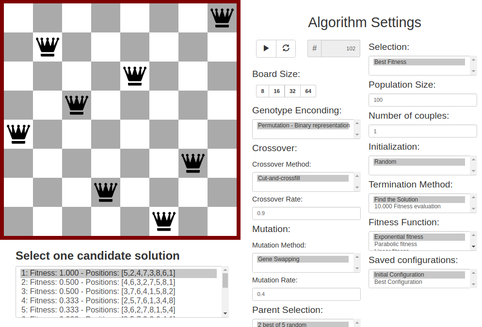
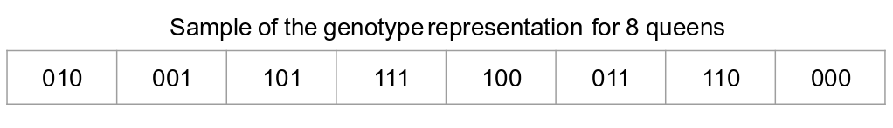
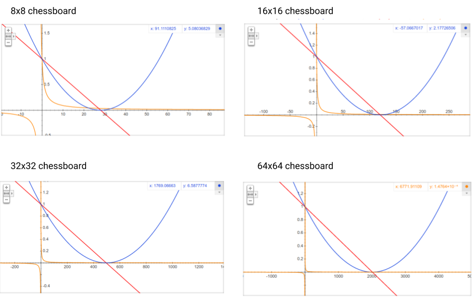
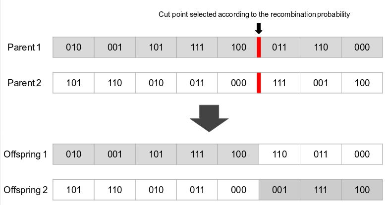
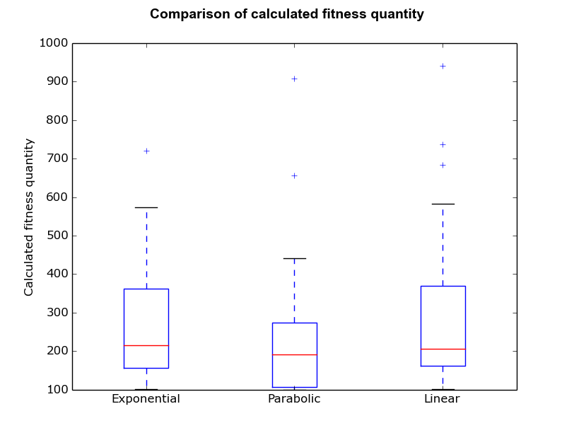
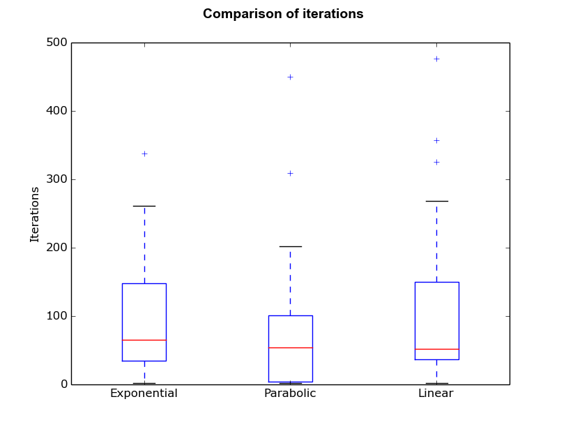
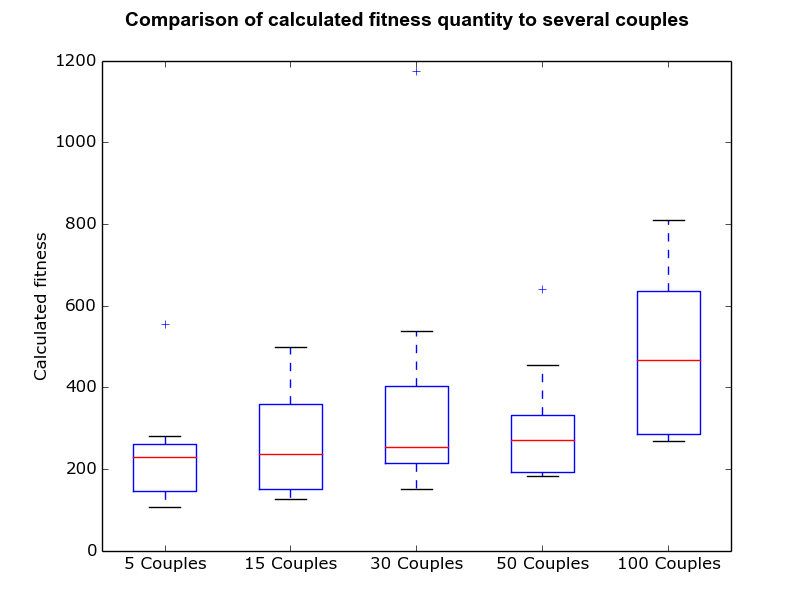
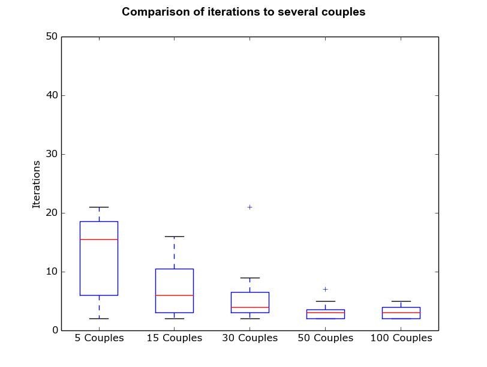

# [Queens AI](https://rc-dynamics.github.io/queens_AI/)
> The [n Queens Pluzze](https://en.wikipedia.org/wiki/Eight_queens_puzzle) resolved with [genetic algorithms](https://en.wikipedia.org/wiki/Genetic_algorithm).

> [Check out our application using Genetic Algorithm on a web site](https://rc-dynamics.github.io/queens_AI/)

## n Queens Puzzle

These applications resolve the *queen's puzzle* to different **board sizes** (8x8, 16x16, 32x32 and 64x64). Remember that the *queen's puzzle* is an exponential problem.

## Genetic Algorithm Solution

### Genotype Representation

Using a vector of strings of bits, we have the following representation:

  
Each gene represents the queen line, that is initialized differently for each queen, and the position of the gene on the genotype refers to the column on the board. 
Every genotype refers to a possible solution (configuration of the table), and to reach a correct answer that genetic algorithm (G.A.) have to change the genes positions on the genotype, this change the queen of line x, to another column.

###  Population
Population represents all genotypes of the algorithm. Random genotypes are responsible for filling the population in the **initialization** part, besides the genotype individuals also has its fitness.
**population size** stars in 100 by default but may be configured by the UI.

###  Fitness Function
Fitness determines how well is a solution given a genotype. So all solutions in the population have your fitness. A bad solution is measured proportionally by the number of collisions.

To determine the queen's collisions, each queen counts how many queens are on her's right diagonals. And the sum of each queen collision number is the *error* of a genotype. 

There are three different **fitness functions** implemented:

| 
  Exponential 
 | 
  Parabolic 
| 
  Linear 
|
| ------ | ------ | ------ |
|  |   |   |

These are the graphics for each **board size**:

###  Parent Selection
The first parent selection method is the **two best of five**; this approach consists in getting five randoms fathers in the population. After, the best two genotype (measured by fitness) among the five are chosen to reproduce. 
Another method is **roulette wheel**, which every genotype has a chance to be selected proportional to its fitness.

###  Crossover
The crossover methods were a **cut and crossfill**. A random position on the genotype is chosen, this position cut the genotype chain of both parents in two parts. Sons were generated by the cross-fill of the parent's parts on the cut position. Two sons per couple were created.

A first son is made of the first part of parent one and the second part of parent two.

**Number os couples** determines the number of crossover in the population. Each pair has two parents and will generate two sons.

To maintain each queen on a different line, no duplicates genes were accepted on a genotype is permitted. To obey this rule, if the second part of the second parent has duplicate genes on the first part of the first parent, the son iterate to another gene on the second parent until there isn't a duplicate.

The **crossover rate** is the probability from 0 to 1.0 to reproduce two chosen parents.

Every iteration needs to calculate the children fitness to introduce them to the population.

###  Mutation
The G.A. **mutation method** implemented two random genes on the genotype and swap their positions. Considering that each genotype has queens for all possibles positions, there isn't new gene to be inserted.

Remember that the **mutation rate** configure the probability from 0 to 1.0 of mutating a son.

### Selection 

After generating sons the population needs to maintain its size, so there are methods to select the final population after reproduction. 
The first method is the **best fitness**, in this approach, the population will be the bests genotypes, so sons replace those with the lower fitness value.
Another way is **generational**, for that, after a father passes through the cross-over phase, his genotype will be replaced by the son. So the old one dies, and the news maintains on the population.

### Termination 
There are two methods of ending the algorithm:
1. **Finding correct solutions**, where no queen can collide with other.
2. **Evaluating 10.000** times the fitness. 

### Analysing Results
We performed tests in 8x8 board with the basic configuration below.
1. Population: **100** genotypes **randomly initialized**.
2. Crossover rate: **0.9**
3. Mutation rate: **0.4**
4. Parent Selection: **2 best of 5.**
5. Number of Couples: **1**
6. Selection: **Best fitness**

Our first test used three different **functions of fitness**, and compared  **number of calculated fitness** and **number of iterations**, that resulted in this graphic 1 below.

| 
  Number of Fitness 
 | 
  Number of Iterations 
|
| ------ | ------ |
|  |   |

Our second test used five different **number of couples**, and compared  **number of calculated fitness** and **number of iterations**. The analyze resulted in this graphic 2 below.

| 
  Number of Fitness 
 | 
  Number of Iterations 
|
| ------ | ------ |
|  |   |

## Running local

1. First, you need to have [npm](https://www.npmjs.com) installed.
2. Install browser-sync using `npm install -g browser-sync`
3. On the project folder run: `browser-sync start --server -f .`

or you can [Running a local server](https://github.com/processing/p5.js/wiki/Local-server)

> Authors: [Roberto Fernandes](https://github.com/bebetocf), [Lucas Cavalcanti](https://github.com/lhcavalcanti), [Carlos Pena](https://github.com/CarlosPena00), [Cristiano Santos](https://github.com/cstiano).
