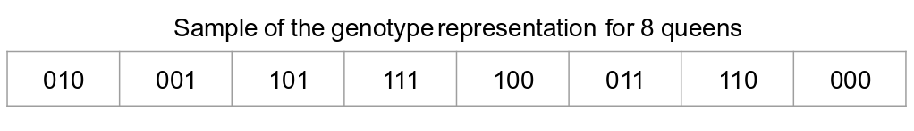

# [Queens_AI](https://rc-dynamics.github.io/queens_AI/)
> The 8 Queens problems resolved with evolutionary algorithms.

## First part

### Genotype representation

Using a bit-string approach, we have the following representation:

Each queen are initialized into a different column, so to reach the solution you only have to change the queens positions vertically by changing their lines.
Thus each cell, in the figure above, represents a position on the vertical axis of the board, that is, represents the line where the queen should be positioned.

## Running local
1 - `npm install -g browser-sync`

2 - `browser-sync start --server -f .`

or [Running a local server](https://github.com/processing/p5.js/wiki/Local-server)
